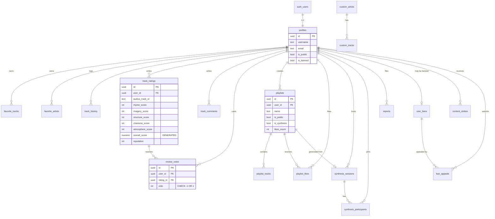

<div align="center">

# 🗄 StreamVault DB

### PostgreSQL Database Design for a Modern Music Streaming Platform

[](https://postgresql.org)
[](https://supabase.com)
[](https://supabase.com/docs/guides/auth/row-level-security)
[]()
[]()
[](LICENSE)

*A production-grade relational database for a full-featured music streaming platform: user management, social reviews, collaborative playlists, content moderation, and more.*

</div>

---

## 📋 Overview

**StreamVault DB** is a complete PostgreSQL database schema designed for a music streaming platform with deep social features. The schema covers the full spectrum of a modern streaming service — from user authentication and content discovery to community-driven reviews, reputation systems, and content moderation with ban management.

This project demonstrates real-world database engineering including:
- Carefully normalized relational schema (22 tables + 1 view)
- Row Level Security (RLS) on all tables — zero trust at DB level
- `SECURITY DEFINER` functions for safe cross-user operations
- Optimized Views for aggregate read performance
- Atomic operations via stored procedures to prevent race conditions
- Strategic denormalization for read-heavy feed endpoints
- `GENERATED ALWAYS AS` columns for computed fields
- Versioned migrations following Flyway/Liquibase conventions

---

## 🗺 Entity Relationship Diagram



---

## ✨ Database Features

| Feature | Description |
|---------|-------------|
| 👤 **User Profiles** | Full user management with avatar storage, visibility controls, and ban system |
| 🎵 **Listening Activity** | Play history, favorite tracks and artists with atomic play count tracking |
| ⭐ **5-Criteria Review System** | Structured ratings with generated overall score + community reputation voting |
| 🏆 **Reputation Engine** | SECURITY DEFINER RPC for safe cross-user reputation recalculation |
| 📋 **Playlists** | Public/private playlists with likes and ordered tracks |
| 🤝 **Synthesis Sessions** | Collaborative playlist generation with race-condition-safe atomic creation |
| 🎤 **Custom Content** | Admin-managed artists and tracks alongside external API content |
| 🚨 **Content Moderation** | Full pipeline: reports → strikes → auto-ban → appeals |
| 🔐 **Row Level Security** | All 22 tables protected with per-table RLS policies |
| ⚡ **Stored Procedures** | 9 RPC functions covering all complex atomic operations |
| 📦 **Versioned Migrations** | Flyway-style V001–V004 migration history |
| 🧩 **Legacy Compatibility** | Legacy tables preserved with clear deprecation documentation |

---

## 🏗 Architecture

### Layer Diagram

```
┌─────────────────────────────────────────────────────────┐
│                    API Layer (PostgREST)                  │
│         Auto-generated REST from PostgreSQL schema        │
└───────────────────────┬─────────────────────────────────┘
                        │
┌───────────────────────▼─────────────────────────────────┐
│              Row Level Security (RLS)                     │
│      All access filtered by auth.uid() at DB level       │
└───────────────────────┬─────────────────────────────────┘
                        │
┌───────────────────────▼─────────────────────────────────┐
│           Business Logic Layer (Stored Procedures)        │
│   SECURITY DEFINER functions for cross-user operations    │
│   Atomic counters · Session management · Reputation       │
└───────────────────────┬─────────────────────────────────┘
                        │
┌───────────────────────▼─────────────────────────────────┐
│                  Data Storage Layer                       │
│  22 Tables · 1 View · Strategic denormalization           │
│  Generated columns · Partial indexes · UPSERT patterns   │
└─────────────────────────────────────────────────────────┘
```

### Domain Layers

| Layer | Tables | Purpose |
|-------|--------|---------|
| **Identity** | `profiles`, `auth.users` | Authentication & user data |
| **Activity** | `track_history`, `favorite_tracks`, `favorite_artists` | Listening behavior tracking |
| **Content** | `track_ratings`, `track_comments`, `review_votes`, `track_ratings_avg` | Social review system |
| **Playlists** | `playlists`, `playlist_tracks`, `playlist_likes` | Collection management |
| **Collaboration** | `synthesis_sessions`, `synthesis_participants` | Collaborative features |
| **Admin Content** | `custom_artists`, `custom_tracks` | Platform-managed content |
| **Moderation** | `reports`, `content_strikes`, `user_bans`, `ban_appeals` | Content governance |
| **Cache** | `artist_profiles` | External API data cache |
| **Legacy** | `users`, `tracks`, `ratings` | Backwards compatibility |

---

## 🛠 Tech Stack

| Technology | Role |
|-----------|------|
| **PostgreSQL 15** | Core relational database engine |
| **Supabase** | Hosted PostgreSQL + Auth + Storage + PostgREST API |
| **Row Level Security** | Database-layer access control |
| **PL/pgSQL** | Stored procedures and triggers |
| **Flyway conventions** | Versioned migration naming (V001, V002...) |

---

## 📂 Repository Structure

```
streamvault-db/
├── README.md                      # This file
├── schema/                        # Table definitions (apply in order)
│   ├── 00_legacy.sql              # Legacy tables (historical compatibility)
│   ├── 01_profiles.sql            # User profiles
│   ├── 02_activity.sql            # Listening history & favorites
│   ├── 03_ratings.sql             # 5-criteria rating system
│   ├── 04_comments.sql            # Track comments
│   ├── 05_review_votes.sql        # Reputation voting
│   ├── 06_playlists.sql           # Playlists & tracks
│   ├── 07_synthesis.sql           # Collaborative sessions
│   ├── 08_custom_content.sql      # Admin-managed content
│   ├── 09_moderation.sql          # Reports, bans, appeals
│   └── 10_artist_profiles.sql     # Artist cache
├── views/
│   └── track_ratings_avg.sql      # Aggregated ratings view
├── functions/                     # Stored procedures (RPC)
│   ├── increment_play_count.sql   # Atomic play count upsert
│   ├── update_review_reputation.sql # SECURITY DEFINER reputation sync
│   ├── synthesis_management.sql   # Session lifecycle functions
│   └── playlist_likes.sql        # Atomic like counters
├── rls/                           # Row Level Security policies
│   ├── profiles_rls.sql
│   ├── ratings_rls.sql
│   ├── playlists_rls.sql
│   └── moderation_rls.sql
├── migrations/                    # Versioned change history
│   ├── V001__initial_schema.sql
│   ├── V002__add_rls_policies.sql
│   ├── V003__add_stored_functions.sql
│   └── V004__add_legacy_and_cache.sql
├── seed/
│   └── seed_example.sql           # Development sample data
├── examples/
│   └── query_examples.sql         # 10 practical query examples
└── docs/                          # Documentation
    ├── ARCHITECTURE.md            # Design decisions & scalability
    ├── TABLES.md                  # Complete table reference
    ├── RELATIONSHIPS.md           # FK map & ER overview
    ├── SECURITY.md                # RLS & SECURITY DEFINER guide
    ├── PERFORMANCE.md             # Indexing & optimization strategy
    └── SETUP.md                   # Deployment instructions
```

---

## 📊 Database Statistics

| Metric | Value |
|--------|-------|
| Total Tables | 22 (19 active + 3 legacy) |
| Views | 1 (`track_ratings_avg`) |
| Stored Procedures | 9 |
| RLS Policies | 25+ |
| Storage Buckets | 3 |
| Unique Constraints | 8 |
| Foreign Keys | 17+ |
| Indexes | 20+ |
| Migration Versions | 4 |

---

## 🔒 Security

All tables have Row Level Security enabled. General access model:

| Role | Access |
|------|--------|
| `anon` | Read public content (reviews, playlists, artist profiles) |
| `authenticated` | Read/write own data only |
| `service_role` | Full access (admin operations) |

Cross-user write operations (e.g., updating reputation on another user's review) use `SECURITY DEFINER` functions that run with elevated privileges but perform only tightly-scoped, auditable operations.

→ See [docs/SECURITY.md](docs/SECURITY.md) for full policy matrix.

---

## ⚡ Performance

Key optimizations:
- **Denormalized `username`/`avatar_url`** in feed tables — eliminates JOIN on hot read paths
- **Generated column** `overall_score` — computed by PostgreSQL, never inconsistent
- **Partial indexes** — `idx_track_ratings_rep WHERE review IS NOT NULL` avoids scanning rows without reviews
- **Atomic UPSERT** for play counts — single round-trip, no SELECT+UPDATE race
- **Aggregated VIEW** `track_ratings_avg` — GROUP BY pre-defined, not re-evaluated per request

→ See [docs/PERFORMANCE.md](docs/PERFORMANCE.md) for indexing strategy.

---

## 🚀 Quick Start

```bash
# Clone
git clone https://github.com/Lumir1n/LS_DB.git
cd LS_DB

# Apply to Supabase via SQL Editor (in order):
# schema/00_legacy.sql → schema/10_artist_profiles.sql
# views/track_ratings_avg.sql
# functions/*.sql
# rls/*.sql
```

→ See [docs/SETUP.md](docs/SETUP.md) for full instructions.

---

## 📖 Documentation

| Document | Description |
|----------|-------------|
| [ARCHITECTURE.md](docs/ARCHITECTURE.md) | Design decisions, data flow, scalability |
| [TABLES.md](docs/TABLES.md) | Full column reference for all 22 tables |
| [RELATIONSHIPS.md](docs/RELATIONSHIPS.md) | FK map, unique constraints, cascade rules |
| [SECURITY.md](docs/SECURITY.md) | RLS policies, SECURITY DEFINER rationale |
| [PERFORMANCE.md](docs/PERFORMANCE.md) | Index strategy, denormalization trade-offs |
| [SETUP.md](docs/SETUP.md) | Supabase and local PostgreSQL setup |

---

## 👤 Author

**Miroslav Gilevich** — Backend / Database Engineer  
GitHub: [@Lumir1n](https://github.com/Lumir1n)

---

## 📋 Overview

**StreamVault DB** is a complete PostgreSQL database schema designed for a music streaming platform with social features. The schema covers the full spectrum of a modern streaming service — from user authentication and content discovery to community-driven reviews, reputation systems, and content moderation with ban management.

This project demonstrates real-world database engineering including:
- Carefully normalized relational schema (22 tables)
- Row Level Security (RLS) on all sensitive tables
- `SECURITY DEFINER` functions for cross-user operations
- Optimized Views for aggregate read performance
- Atomic operations via stored procedures to prevent race conditions
- Denormalization strategies for read-heavy workloads

---

## ✨ Key Features

| Feature | Description |
|---------|-------------|
| 👤 **User Profiles** | Full user management with avatar storage, visibility controls, and ban system |
| 🎵 **Listening Activity** | Play history, favorite tracks, favorite artists with play count tracking |
| ⭐ **5-Criteria Review System** | Structured music reviews with 5 scored dimensions + free-text |
| 🏆 **Reputation Voting** | Community voting on reviews with atomic reputation recalculation |
| 📋 **Playlists** | Public/private playlists with likes and track ordering |
| 🤝 **Synthesis Sessions** | Collaborative playlist generation between users via invite codes |
| 🎤 **Custom Content** | Admin-managed artists and tracks alongside third-party API content |
| 🚨 **Content Moderation** | Full reports → strikes → bans → appeals workflow |
| 🔐 **Row Level Security** | Per-table RLS policies protecting all user data |
| ⚡ **Stored Procedures** | 9 RPC functions for complex atomic operations |

---

## 📐 Architecture

```
┌─────────────────────────────────────────────────────┐
│                   Authentication                      │
│              auth.users (Supabase Auth)               │
└──────────────────────┬──────────────────────────────┘
                       │ 1:1
┌──────────────────────▼──────────────────────────────┐
│                     profiles                          │
│         (username, avatar, bio, visibility)           │
└──┬─────────┬─────────┬─────────┬────────────────────┘
   │         │         │         │
   ▼         ▼         ▼         ▼
Activity  Content  Playlists  Moderation
Layer     Layer    Layer      Layer
```

### Layers

**Activity Layer** — Tracks user listening behavior:
`track_history` · `favorite_tracks` · `favorite_artists`

**Content Layer** — Reviews, comments, ratings and reputation:
`track_ratings` · `track_comments` · `review_votes` · `track_ratings_avg` (VIEW)

**Playlists Layer** — Playlist management and collaboration:
`playlists` · `playlist_tracks` · `playlist_likes` · `synthesis_sessions` · `synthesis_participants`

**Admin Content Layer** — Platform-managed content:
`custom_artists` · `custom_tracks`

**Moderation Layer** — Complete content moderation workflow:
`reports` · `content_strikes` · `user_bans` · `ban_appeals`

---

## 📂 Repository Structure

```
streamvault-db/
├── README.md
├── schema/
│   ├── 01_profiles.sql          # User profiles table
│   ├── 02_activity.sql          # Listening history & favorites
│   ├── 03_ratings.sql           # 5-criteria rating system
│   ├── 04_comments.sql          # Track comments
│   ├── 05_review_votes.sql      # Reputation voting system
│   ├── 06_playlists.sql         # Playlists & tracks
│   ├── 07_synthesis.sql         # Collaborative session system
│   ├── 08_custom_content.sql    # Admin-managed artists & tracks
│   └── 09_moderation.sql        # Reports, bans, appeals
├── views/
│   └── track_ratings_avg.sql    # Aggregated ratings view
├── functions/
│   ├── increment_play_count.sql
│   ├── update_review_reputation.sql
│   ├── synthesis_management.sql
│   └── playlist_likes.sql
├── rls/
│   ├── profiles_rls.sql
│   ├── ratings_rls.sql
│   ├── playlists_rls.sql
│   └── moderation_rls.sql
├── seed/
│   └── seed_example.sql
└── docs/
    ├── SCHEMA.md
    ├── TABLES.md
    ├── FUNCTIONS.md
    ├── SECURITY.md
    └── PERFORMANCE.md
```

---

## 🗺 Entity Relationship Overview

```
auth.users ──────────────── profiles
                                │
          ┌─────────────────────┼──────────────────────┐
          │                     │                      │
     Activity              Content                 Social
          │                     │                      │
   track_history         track_ratings          playlists
   favorite_tracks    ──── review_votes        playlist_tracks
   favorite_artists   └── [VIEW: avg]          playlist_likes
                           track_comments     synthesis_sessions
                                              synthesis_participants

                         Moderation
                              │
                        reports
                        content_strikes
                        user_bans
                        ban_appeals

                         Admin Content
                              │
                        custom_artists
                        custom_tracks
```

---

## 🚀 Quick Start

### Prerequisites
- PostgreSQL 14+ or Supabase project
- `psql` CLI or Supabase Dashboard SQL Editor

### Deploy Schema

```bash
# 1. Clone the repository
git clone https://github.com/Lumir1n/LS_DB.git
cd LS_DB

# 2. Apply in order
psql -U postgres -d your_database -f schema/01_profiles.sql
psql -U postgres -d your_database -f schema/02_activity.sql
psql -U postgres -d your_database -f schema/03_ratings.sql
psql -U postgres -d your_database -f schema/04_comments.sql
psql -U postgres -d your_database -f schema/05_review_votes.sql
psql -U postgres -d your_database -f schema/06_playlists.sql
psql -U postgres -d your_database -f schema/07_synthesis.sql
psql -U postgres -d your_database -f schema/08_custom_content.sql
psql -U postgres -d your_database -f schema/09_moderation.sql

# 3. Apply views
psql -U postgres -d your_database -f views/track_ratings_avg.sql

# 4. Apply functions
psql -U postgres -d your_database -f functions/increment_play_count.sql
psql -U postgres -d your_database -f functions/update_review_reputation.sql
psql -U postgres -d your_database -f functions/synthesis_management.sql
psql -U postgres -d your_database -f functions/playlist_likes.sql

# 5. Apply RLS policies
psql -U postgres -d your_database -f rls/profiles_rls.sql
psql -U postgres -d your_database -f rls/ratings_rls.sql
psql -U postgres -d your_database -f rls/playlists_rls.sql
psql -U postgres -d your_database -f rls/moderation_rls.sql
```

### For Supabase
Paste each file into **Supabase Dashboard → SQL Editor** and run.

---

## 📊 Database Statistics

| Metric | Value |
|--------|-------|
| Total Tables | 19 |
| Views | 1 |
| Stored Procedures | 9 |
| RLS Policies | 20+ |
| Storage Buckets | 3 |
| Unique Constraints | 7 |
| Foreign Keys | 15+ |

---

## 🔒 Security Model

All tables have **Row Level Security (RLS)** enabled. The general principle:

- `authenticated` role — can read/write own data only
- `anon` role — can read public data (public playlists, public reviews, public profiles)
- `service_role` — full access (admin operations)

For cross-user write operations (e.g., updating another user's review reputation), dedicated `SECURITY DEFINER` functions are used to safely bypass RLS while maintaining audit trails.

See [docs/SECURITY.md](docs/SECURITY.md) for detailed policy descriptions.

---

## ⚡ Performance Highlights

- **Denormalized fields** (`username`, `user_avatar_url`) in `track_ratings` and `track_comments` to avoid JOIN overhead on read-heavy feeds
- **Aggregated VIEW** `track_ratings_avg` pre-computes averages per track — no GROUP BY on every request
- **play_count tracking** via upsert pattern with `ON CONFLICT` — single atomic operation, no SELECT+UPDATE race
- **Batch profile loading** via `id IN (...)` instead of N individual queries

See [docs/PERFORMANCE.md](docs/PERFORMANCE.md) for indexing recommendations.

---

## 🏗 Design Decisions

### Why denormalize username/avatar in ratings and comments?

The reviews feed is a high-read endpoint where displaying usernames alongside content is required. Performing a JOIN to `profiles` on every request at scale would be expensive. Denormalization allows O(1) reads at the cost of some write complexity (username changes don't auto-propagate to existing reviews — an acceptable trade-off for a social platform).

### Why use SECURITY DEFINER for reputation updates?

PostgreSQL RLS prevents users from updating rows they don't own. The `update_review_reputation` function recalculates `SUM(vote)` from `review_votes` and writes the result to `track_ratings`. Since a user voting on someone else's review needs to update that review's reputation field, a `SECURITY DEFINER` stored procedure is the correct and safe solution — it runs with elevated privileges but only performs a controlled, auditable operation.

### Why store synthesis as a separate session/participant model?

The synthesis feature requires knowing *who* joined a session and tracking the state of collaborative playlist generation. A simple many-to-many between users would not capture the session lifecycle (invite code, status, resulting playlist). The current model allows future extensions like session expiry, participant limits, and real-time synchronization.

---

## 📝 License

MIT — feel free to adapt this schema for your own streaming platform projects.

---

## 👤 Author

**Miroslav Gilevich** — Backend / Database Engineer  
GitHub: [@Lumir1n](https://github.com/Lumir1n)
